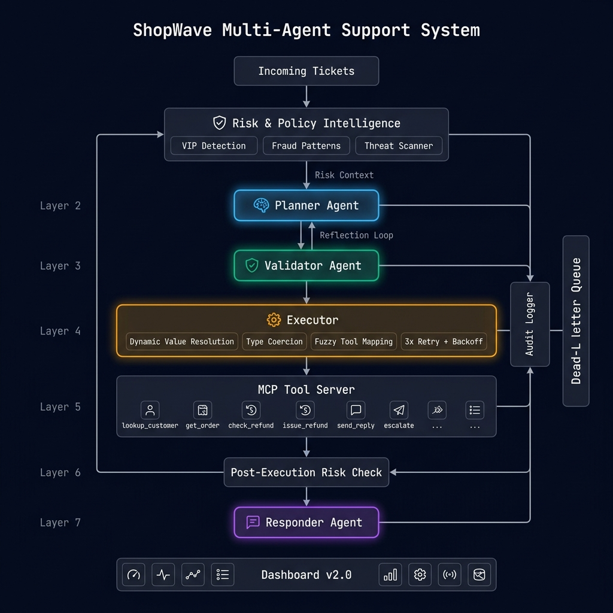

# 🛒 ShopWave Multi-Agent Customer Support System

> A production-grade, self-correcting multi-agent system using **MCP + LLM** for autonomous customer support ticket resolution.
> Built for the **Ksolves Agentic AI Hackathon 2026**.

---

## 🏗️ Architecture



```
Ticket → Risk Analysis → Planner Agent → Validator Agent → Executor (MCP) → Post-Exec Risk → Responder → Audit Log
                ↑               ↑                                    |
                │               └──── Reflection Loop (on failure) ──┘
                └── VIP / Fraud / Threat Intelligence ──────────────────
```

### Agent Pipeline

| Agent | Role | Model |
|---|---|---|
| **Risk Analyzer** | Pre-execution risk scoring: VIP detection, fraud patterns, threat language, policy adjustments | Rule-based engine |
| **Planner** | Classifies intent, estimates confidence, generates risk-aware execution plans | Gemini 2.5 Flash |
| **Validator** | Reviews plans for safety, ShopWave policy compliance, tool ordering. Can reject/fix plans | Gemini 2.5 Flash |
| **Executor** | Runs MCP tool calls with dynamic value resolution, type coercion, and retry logic | N/A (tool runner) |
| **Responder** | Generates human-like ShopWave customer replies following tone guidelines | Gemini 2.5 Flash |
| **Orchestrator** | Coordinates all agents, manages reflection loops, dead-letter queue, duplicate guard | N/A (pipeline) |

### MCP Tools (ShopWave APIs)

| Tool | Purpose | Failure Rate |
|---|---|---|
| `lookup_customer_by_email` | Find customer by email address | 10% |
| `get_customer` | Retrieve customer profile (tier, notes, history) | 10% |
| `get_order` | Retrieve order details (status, dates, return deadline) | 12% |
| `get_product` | Retrieve product info (warranty, return window) | 8% |
| `get_orders_by_customer` | Find all orders for a customer | 10% |
| `check_refund_eligibility` | Check if order qualifies for refund | 18% |
| `issue_refund` | Process a refund (IRREVERSIBLE) | 20% |
| `cancel_order` | Cancel order (processing status only) | 10% |
| `search_knowledge_base` | Search ShopWave KB (policies, FAQs) | 5% |
| `send_reply` | Send reply to customer | 8% |
| `escalate` | Escalate to human agent with summary | 5% |

> Tools simulate real-world conditions: random timeouts, 503 errors, and malformed responses.

## ✨ Key Features

### Core Agent Capabilities
- **🔄 Self-Healing Reflection Loop**: On execution failure, planner re-plans with root cause context (max 2 loops)
- **🛡️ Intelligent Validator**: Catches unsafe plans (refund without eligibility check, social engineering)
- **📊 Confidence Calibration**: Plans below 0.6 confidence → auto-escalate
- **📬 Dead-Letter Queue**: Failed tickets preserved for manual review
- **📝 Full Audit Trail**: Every thought, action, decision, and error logged to JSON
- **⚡ Concurrent Processing**: `asyncio.gather()` for parallel ticket processing
- **🔁 3x Exponential Retry**: Backoff on tool failures with timeout protection

### v2.0 — Production Hardening
- **🛡️ Risk & Policy Intelligence**: Pre-execution risk analysis with VIP detection, fraud pattern matching, threat language scanning
- **🔍 Dynamic Value Resolution**: Executor automatically resolves `step_2_result.amount` → `129.99` (no more reflection dependency)
- **🔢 Type Coercion**: `"129.99"` (string) → `129.99` (float) for numeric parameters
- **🎯 Fuzzy Tool Mapping**: Handles 50+ LLM hallucination patterns (`send_message` → `send_reply`)
- **🚫 Duplicate Ticket Guard**: Prevents re-processing of already-handled tickets
- **👑 VIP Privilege Engine**: Tier-aware return window extensions and priority handling
- **🔴 Threat Detection**: Hostile/legal language → flag + escalation priority
- **📈 Post-Execution Risk Check**: Fraud detection on refund amounts after execution

## 🚀 Quick Start

### 1. Install Dependencies

```bash
python -m venv venv
.\venv\Scripts\activate     # Windows
pip install -r requirements.txt
```

### 2. Configure API Key

Copy the example env file and add your keys:

```bash
copy .env.example .env      # Windows
# Then edit .env with your actual API keys
```

```
GOOGLE_API_KEY=your-actual-api-key
GROQ_API_KEY=your-groq-api-key
```

### 3. Run the Agent

```bash
# Process all 20 hackathon tickets
python main.py

# Process a single ticket
python main.py --ticket TKT-001

# Verbose output with expected actions
python main.py --verbose --limit 5

# Sequential processing
python main.py --sequential
```

### 4. Launch Dashboard

```bash
# Real-time audit visualization with risk intelligence
uvicorn dashboard:app --reload
# Open http://localhost:8000
```

### 5. Docker Deployment (Bonus)

The system includes full Docker support for containerized execution.

```bash
# Build and run both the agent and dashboard services
docker compose up --build

# Open http://localhost:8000 to see live results
# The agent will automatically process the 20 tickets in rate-limit-safe batches.
```

## 📋 Data (Official Hackathon Data)

All data sourced from the official `ksolves/agentic_ai_hackthon_2026_sample_data` repo:

| File | Contents |
|---|---|
| `hackathon_data/tickets.json` | 20 support tickets (varying complexity tiers 1-3) |
| `hackathon_data/customers.json` | 10 customers (standard, premium, VIP tiers) |
| `hackathon_data/orders.json` | 15 orders (processing, shipped, delivered) |
| `hackathon_data/products.json` | 8 products (electronics, footwear, home, sports) |
| `hackathon_data/knowledge-base.md` | ShopWave policies (returns, refunds, warranty, escalation) |

## 📁 Project Structure

```
├── agent/
│   ├── planner.py          # Intent classification + risk-aware plan generation
│   ├── validator.py        # Plan validation + safety checks + deterministic rules
│   ├── executor.py         # MCP tool execution with dynamic resolution + retries
│   ├── risk_analyzer.py    # VIP detection, fraud patterns, threat scanning
│   ├── responder.py        # ShopWave customer reply generation
│   ├── orchestrator.py     # Pipeline coordination + reflection + duplicate guard
│   └── audit_logger.py     # Comprehensive audit logging
├── mcp_server/
│   ├── server.py           # FastMCP server with 11 tools + realistic failure sim
│   └── schemas.py          # Pydantic models for I/O
├── hackathon_data/         # Official hackathon data
│   ├── tickets.json
│   ├── customers.json
│   ├── orders.json
│   ├── products.json
│   └── knowledge-base.md
├── output/
│   ├── audit_log.json      # Generated audit trail
│   └── results_summary.json
├── config.py               # Configuration & thresholds
├── main.py                 # Entry point (single command)
├── dashboard.py            # Real-time Intel Dashboard v2.0
├── architecture.png        # System architecture diagram
├── failure_modes.md        # Failure documentation (9+ scenarios)
├── .env.example            # API key template (safe to commit)
└── requirements.txt
```

## 🧠 Design Philosophy

> *"Our system doesn't just execute tasks — it detects failures, understands root causes, and autonomously corrects its behavior in real time."*

1. **Fail intentionally**: MCP tools have realistic failure rates (5-20%). The agent must handle it.
2. **Validate everything**: Validator catches unsafe plans before execution.
3. **Reflect on failure**: Planner re-plans using root cause context instead of giving up.
4. **Never lose data**: Dead-letter queue preserves unresolvable tickets.
5. **Know your risk**: Pre-execution risk analysis flags VIPs, threats, and fraud before any action.
6. **Resolve dynamically**: Executor resolves inter-step references automatically — no reflection dependency.
7. **Log everything**: Audit trail proves the agent's intelligence and decision-making.

## 🛡️ Risk Intelligence (v2.0)

The system includes a dedicated Risk & Policy Intelligence engine that runs before AND after execution:

| Capability | Description |
|---|---|
| **VIP Detection** | Identifies Tier 2/3 customers, applies extended return windows |
| **Fraud Patterns** | High-value refund alerts, new account flags, velocity checks |
| **Threat Scanner** | Detects hostile/legal language, social engineering attempts |
| **Policy Engine** | Tier-aware adjustments (VIP: +15 days, Premium: +7 days) |
| **Post-Exec Audit** | Verifies refund amounts, flags anomalies after execution |

## ⚙️ Tech Stack

- **Tools Protocol**: MCP (Model Context Protocol) via FastMCP
- **LLM**: Google Gemini 2.5 Flash / Groq (configurable)
- **Language**: Python 3.11+
- **Async**: asyncio for concurrency
- **Dashboard**: FastAPI + vanilla JS (real-time polling)
- **Validation**: Pydantic for schema enforcement
- **Retry**: tenacity for exponential backoff
